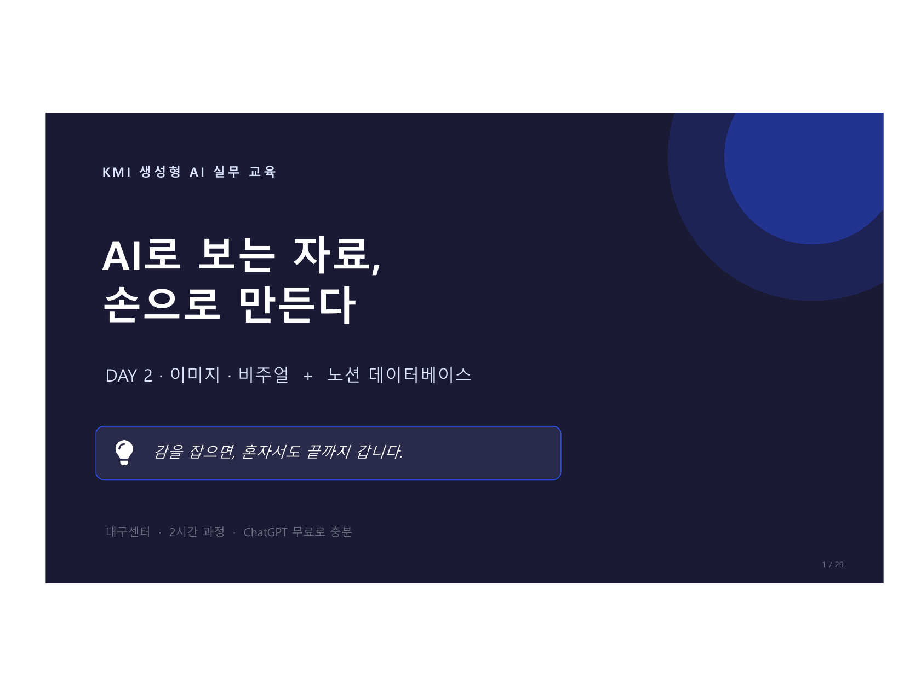
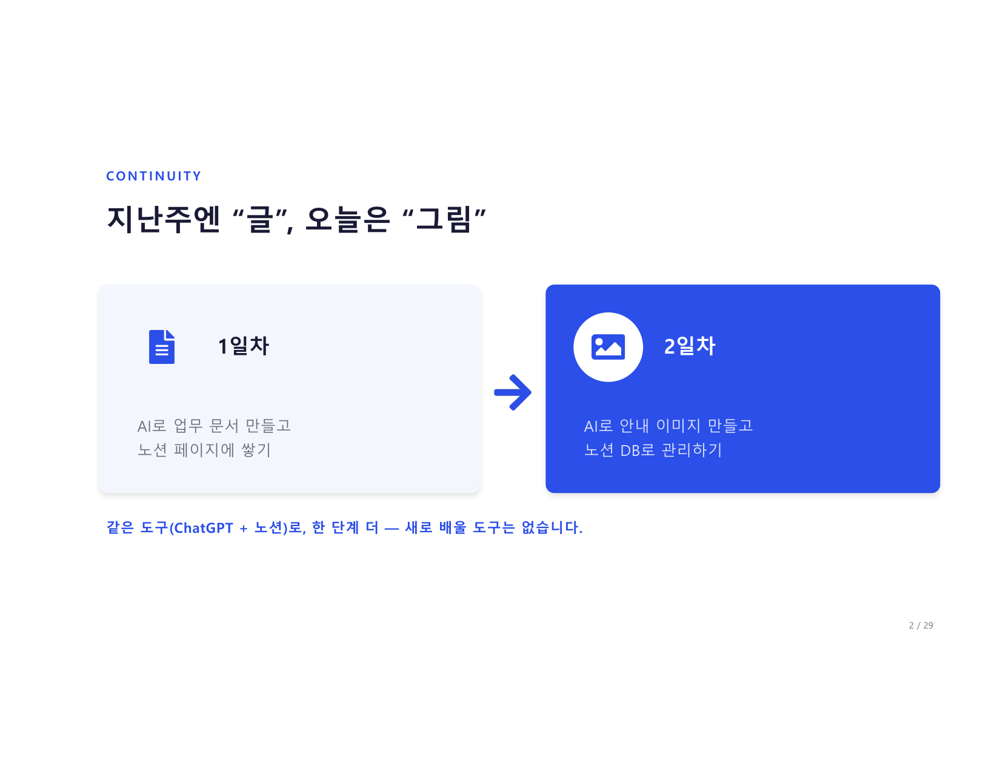
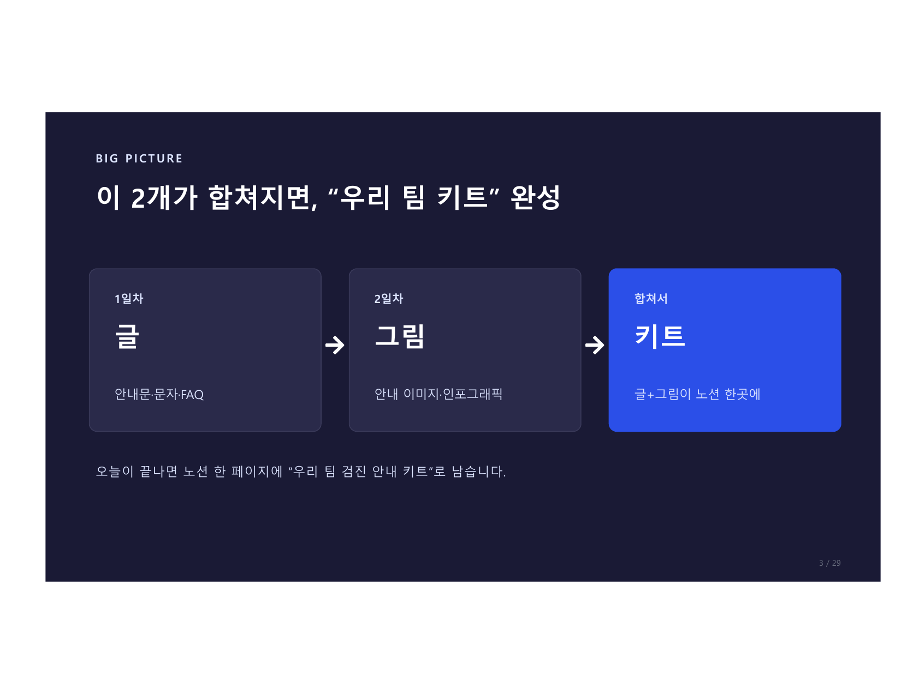
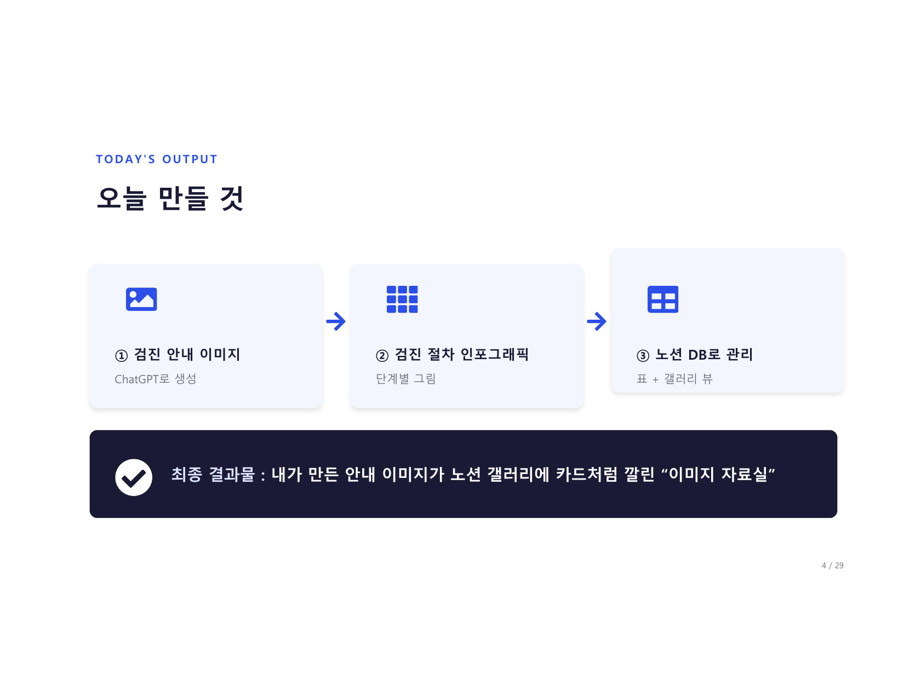
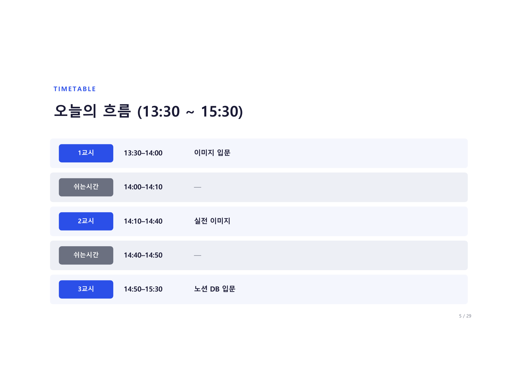
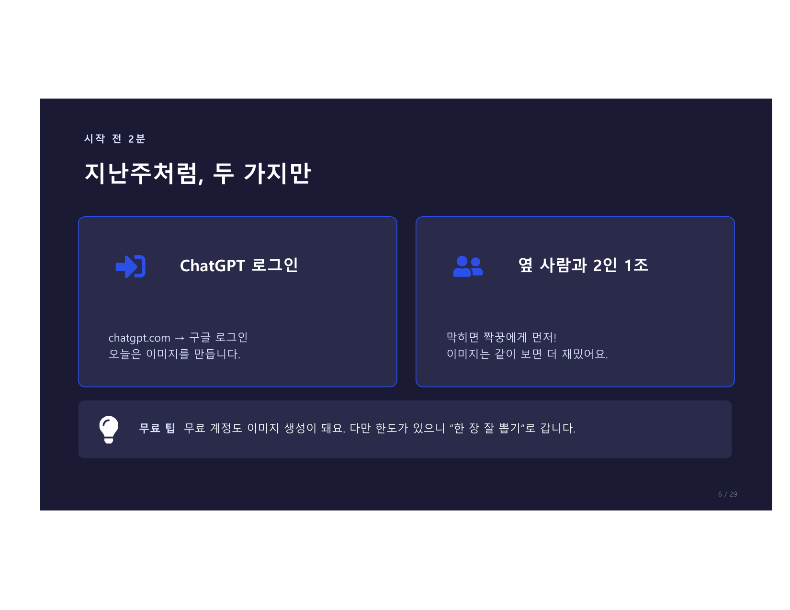

# AI로 보는 자료, 손으로 만든다

> **DAY 2 · 이미지 · 비주얼 + 노션 데이터베이스**
> 감을 잡으면, 혼자서도 끝까지 갑니다.

<figure markdown>
  { width="700" }
</figure>

---

## 지난주엔 "글", 오늘은 "그림"

<figure markdown>
  { width="700" }
</figure>

| | 1일차 | 2일차 |
|--|-------|-------|
| **만든 것** | AI로 업무 문서 만들고 | AI로 안내 이미지 만들고 |
| **저장** | 노션 페이지에 쌓기 | 노션 DB로 관리하기 |

같은 도구(ChatGPT + 노션)로, 한 단계 더 — 새로 배울 도구는 없습니다.

---

## 이 2개가 합쳐지면, "우리 팀 키트" 완성

<figure markdown>
  { width="700" }
</figure>

| | 1일차 | 2일차 | 합쳐서 |
|--|-------|-------|--------|
| **내용** | 글 | 그림 | 키트 |
| **결과물** | 안내문·문자·FAQ | 안내 이미지·인포그래픽 | 글+그림이 노션 한곳에 |

오늘이 끝나면 노션 한 페이지에 **"우리 팀 검진 안내 키트"** 로 남습니다.

---

## 오늘 만들 것

<figure markdown>
  { width="700" }
</figure>

| # | 만들 것 | 도구 | 결과 |
|---|---------|------|------|
| ① | 검진 안내 이미지 | ChatGPT로 생성 | 안내 이미지 1장 |
| ② | 검진 절차 인포그래픽 | ChatGPT로 생성 | 단계별 그림 |
| ③ | 노션 DB로 관리 | Notion | 표 + 갤러리 뷰 |

**최종 결과물:** 내가 만든 안내 이미지가 노션 갤러리에 카드처럼 깔린 "이미지 자료실"

---

## 오늘의 흐름

<figure markdown>
  { width="700" }
</figure>

```
13:30 ─── 1교시 · 이미지 입문 (30분)
14:00 ─── 쉬는시간 (10분)
14:10 ─── 2교시 · 실전 이미지 (30분)
14:40 ─── 쉬는시간 (10분)
14:50 ─── 3교시 · 노션 DB 입문 (40분)
15:30 ─── 종료
```

---

## 수업 전 2분 체크리스트

<figure markdown>
  { width="700" }
</figure>

=== "ChatGPT 로그인"

    1. [chatgpt.com](https://chatgpt.com) 접속
    2. **구글 계정**으로 로그인
    3. 새 채팅 화면이 보이면 성공 ✅

    !!! tip "무료 이미지 생성 팁"
        무료 계정도 이미지 생성이 됩니다.
        다만 한도가 있으니 **"한 장 잘 뽑기"** 로 갑니다.

=== "2인 1조"

    막히면 짝꿍에게 먼저!
    이미지는 같이 보면 더 재밌어요 :)

---

## 이 가이드 사용법

!!! info "언제든 꺼내보세요"
    수업 중 놓친 내용, 나중에 혼자 복습할 때,
    팀원에게 공유할 때 — 이 페이지를 북마크해두세요.

- **1교시** → ChatGPT 이미지 4요소, 프롬프트 팁
- **2교시** → 실전 이미지 만들기, 인포그래픽
- **3교시** → 노션 데이터베이스, 갤러리 뷰

---

## 2주, 한 사이클 완성

```
① 글로 안내 만들고  →  ② 그림으로 보기 좋게  →  ③ 노션 DB에 모아 재사용
```

> **이제 여러분은 AI로 글·그림을 만들고, 노션에 모아 팀과 재사용할 수 있습니다.**
