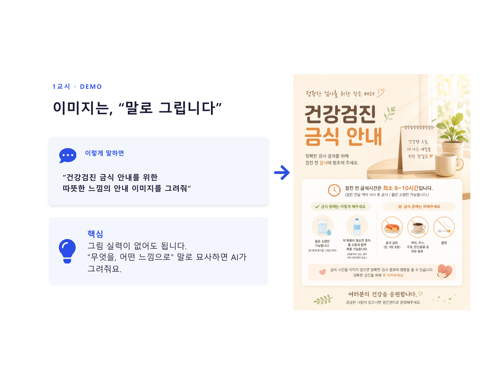
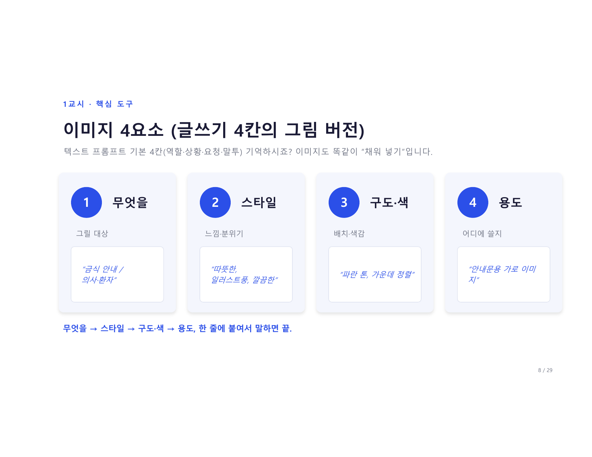
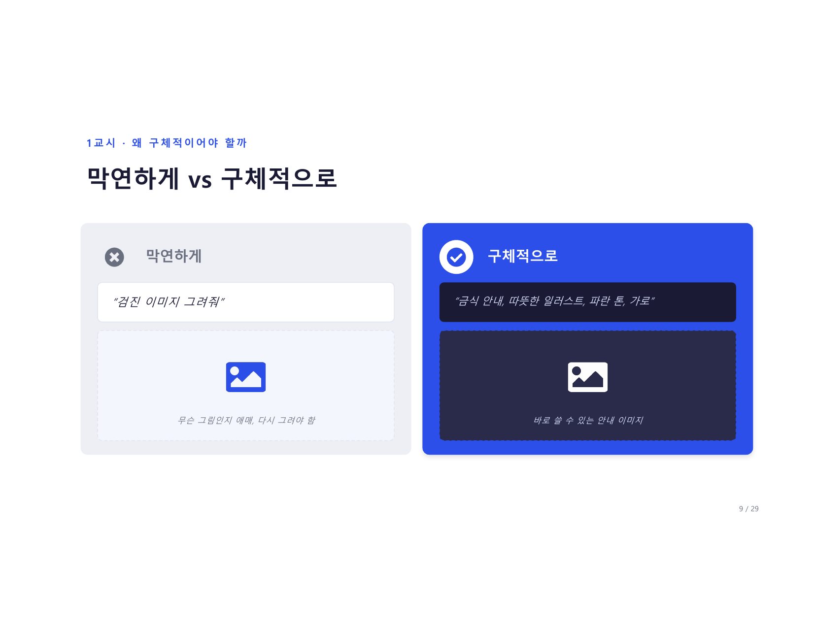
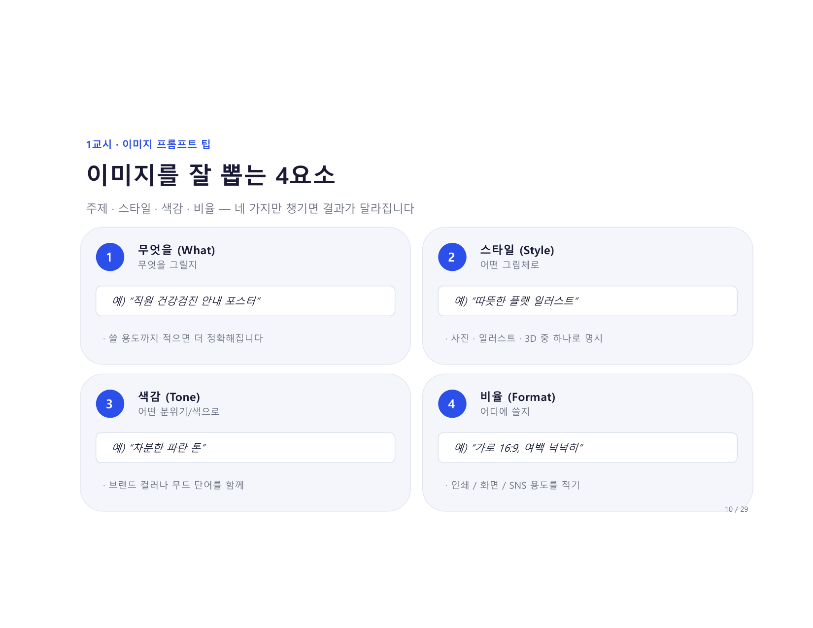
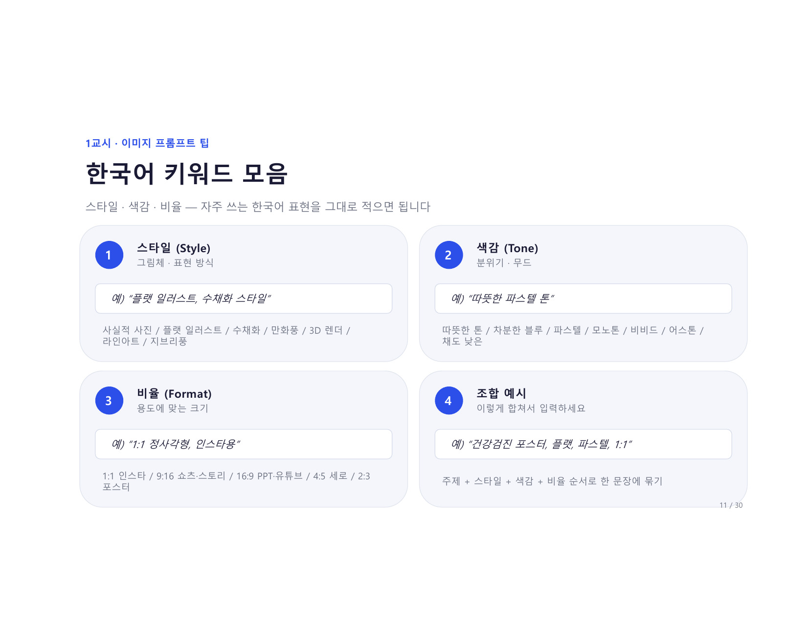
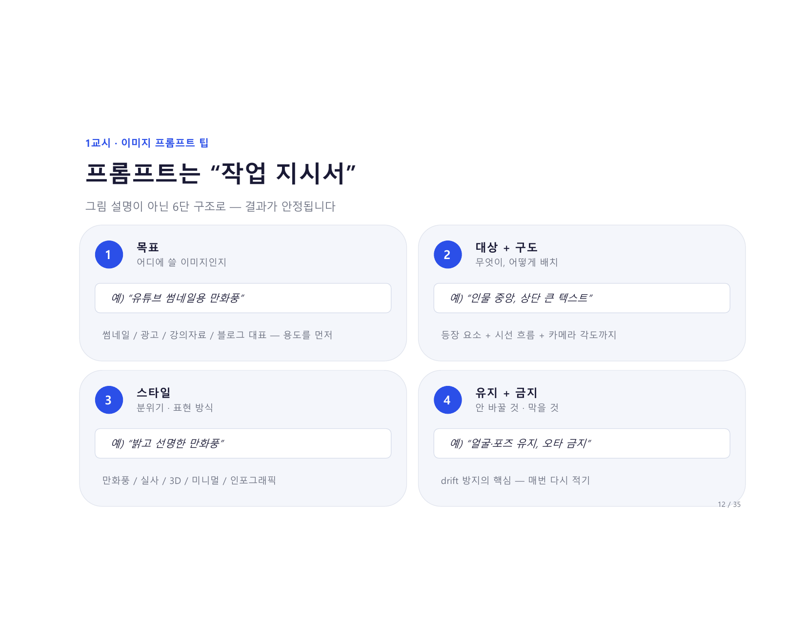
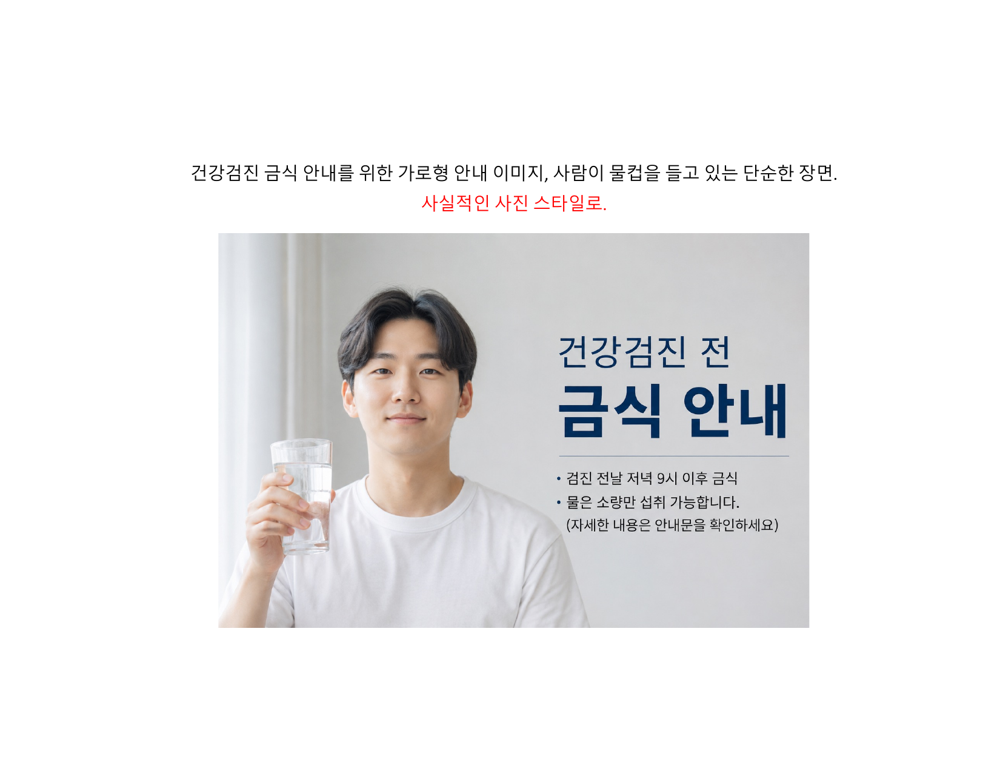
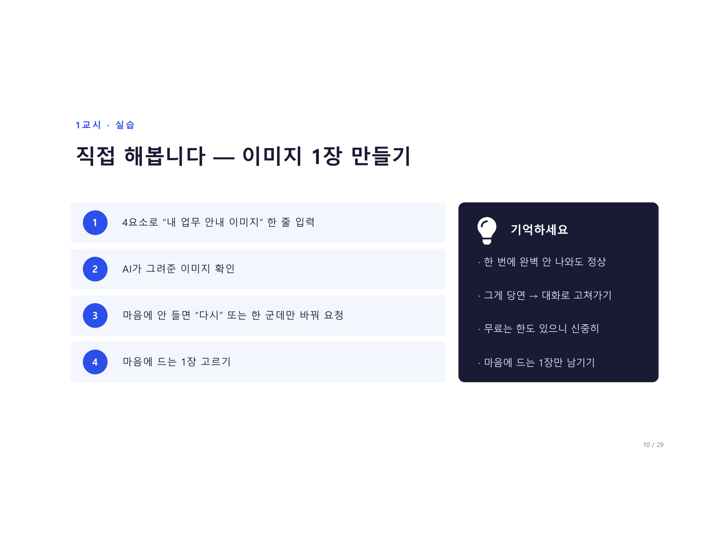
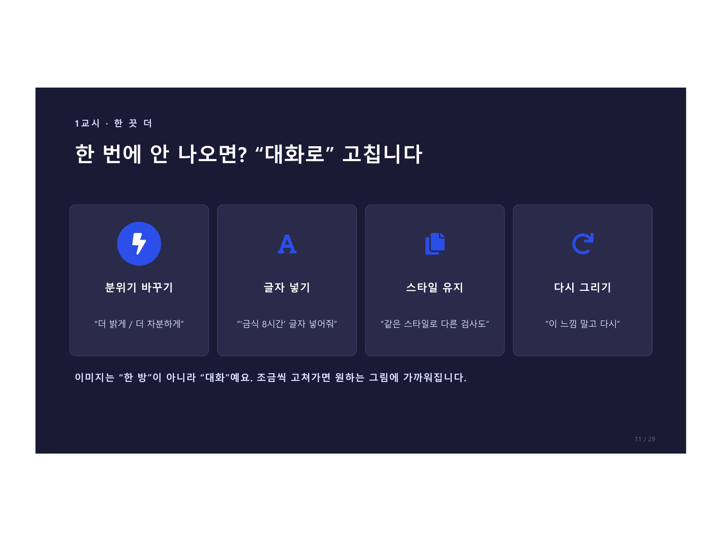
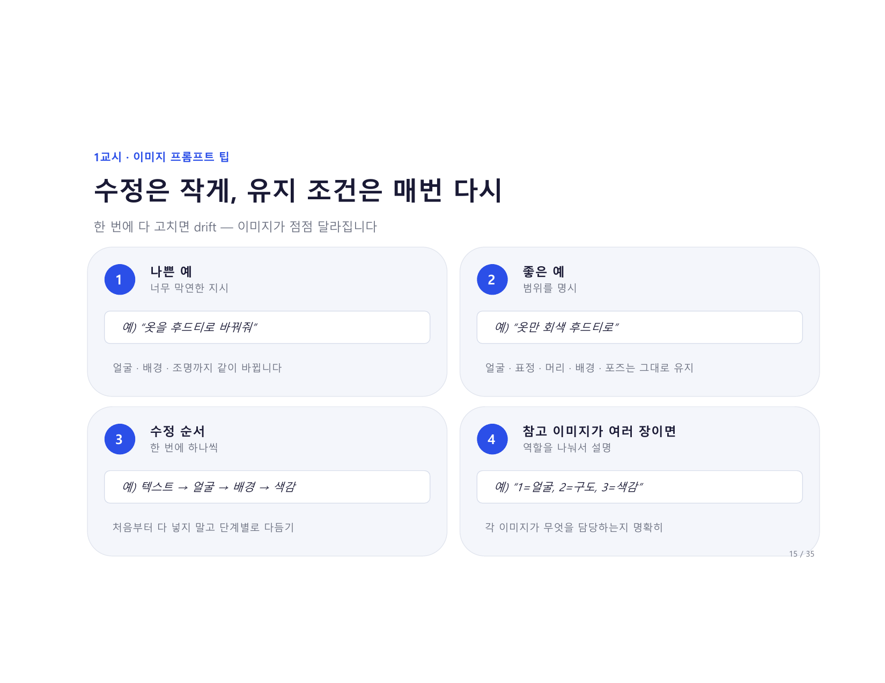

# 1교시 · 이미지 입문

> **13:30 – 14:00** · 오늘 가장 중요한 30분입니다.

---

## 이미지는, "말로 그립니다" (DEMO)

<figure markdown>
  { width="700" }
</figure>

이렇게 말하면:

```
"건강검진 금식 안내를 위한
따뜻한 느낌의 안내 이미지를 그려줘"
```

AI가 바로 → 안내 이미지를 생성해줍니다.

!!! success "핵심 포인트"
    그림 실력이 없어도 됩니다.
    **"무엇을, 어떤 느낌으로"** 말로 묘사하면 AI가 그려줘요.

---

## 막연하게 vs 구체적으로

<figure markdown>
  { width="700" }
</figure>

=== "막연하게 ❌"

    **입력:**
    ```
    "검진 이미지 그려줘"
    ```

    **결과:**
    - 무슨 그림인지 애매
    - 다시 그려야 함

=== "구체적으로 ✅"

    **입력:**
    ```
    "금식 안내, 따뜻한 일러스트, 파란 톤, 가로"
    ```

    **결과:**
    - 바로 쓸 수 있는 안내 이미지

**차이는 "맥락" 한 끗 — 그 맥락을 빠짐없이 담는 게 이미지 4요소입니다.**

---

## 이미지 4요소 (글쓰기 4칸의 그림 버전)

<figure markdown>
  { width="700" }
</figure>

> 텍스트 프롬프트 기본 4칸(역할·상황·요청·말투) 기억하시죠? 이미지도 똑같이 "채워 넣기"입니다.

| 요소 | 이름 | 내용 | 예시 |
|------|------|------|------|
| 1 | **무엇을** | 그릴 대상 | "금식 안내 / 의사·환자" |
| 2 | **스타일** | 느낌·분위기 | "따뜻한, 일러스트풍, 깔끔한" |
| 3 | **구도·색** | 배치·색감 | "파란 톤, 가운데 정렬" |
| 4 | **용도** | 어디에 쓸지 | "안내문용 가로 이미지" |

**무엇을 → 스타일 → 구도·색 → 용도, 한 줄에 붙여서 말하면 끝.**

---

## 이미지를 잘 뽑는 4요소 상세

<figure markdown>
  { width="700" }
</figure>

=== "1. 무엇을 (What)"

    무엇을 그릴지

    - 예) "직원 건강검진 안내 포스터"
    - 쓸 용도까지 적으면 더 정확해집니다

=== "2. 스타일 (Style)"

    어떤 그림체로

    - 예) "따뜻한 플랫 일러스트"
    - 사진 · 일러스트 · 3D 중 하나로 명시

=== "3. 색감 (Tone)"

    어떤 분위기/색으로

    - 예) "차분한 파란 톤"
    - 브랜드 컬러나 무드 단어를 함께

=== "4. 비율 (Format)"

    어디에 쓸지

    - 예) "가로 16:9, 여백 넉넉히"
    - 인쇄 / 화면 / SNS 용도를 적기

---

## 한국어 키워드 모음

<figure markdown>
  { width="700" }
</figure>

=== "스타일 (Style)"

    그림체 · 표현 방식

    | 키워드 | 설명 |
    |--------|------|
    | 플랫 일러스트 | 단순하고 깔끔한 2D 그림 |
    | 수채화 스타일 | 부드럽고 따뜻한 느낌 |
    | 사실적 사진 | 카메라로 찍은 듯한 느낌 |
    | 만화풍 / 카툰 | 친근하고 가벼운 느낌 |
    | 3D 렌더 | 입체적이고 현대적인 느낌 |
    | 라인아트 | 선으로만 그린 간결한 느낌 |
    | 지브리풍 | 따뜻하고 서정적인 일본 애니 느낌 |

=== "색감 (Tone)"

    분위기 · 무드

    | 키워드 | 설명 |
    |--------|------|
    | 따뜻한 톤 | 오렌지·베이지 계열, 편안함 |
    | 차분한 블루 | 신뢰감 있는 파란 계열 |
    | 파스텔 | 부드럽고 연한 색감 |
    | 모노톤 | 흑백 또는 단색 |
    | 비비드 | 채도 높고 강렬한 색 |
    | 어스톤 | 자연적인 흙·녹색 계열 |
    | 채도 낮은 | 차분하고 고급스러운 느낌 |

=== "비율 (Format)"

    용도에 맞는 크기

    | 비율 | 용도 |
    |------|------|
    | 1:1 | 인스타그램 정사각형 |
    | 9:16 | 쇼츠·스토리 세로형 |
    | 16:9 | PPT·유튜브 가로형 |
    | 4:5 | 인스타 세로형 |
    | 2:3 | 포스터형 |

=== "조합 예시"

    **이렇게 합쳐서 입력하세요:**
    ```
    건강검진 포스터, 플랫 일러스트, 파스텔 톤, 1:1 정사각형
    ```
    주제 + 스타일 + 색감 + 비율 순서로 한 문장에 묶기

---

## 프롬프트는 "작업 지시서"

<figure markdown>
  { width="700" }
</figure>

그림 설명이 아닌 6단 구조로 — 결과가 안정됩니다.

| 단계 | 항목 | 예시 |
|------|------|------|
| 1 | **목표** — 어디에 쓸 이미지인지 | "유튜브 썸네일용 만화풍" |
| 2 | **대상 + 구도** — 무엇이, 어떻게 배치 | "인물 중앙, 상단 큰 텍스트" |
| 3 | **스타일** — 분위기·표현 방식 | "밝고 선명한 만화풍" |
| 4 | **유지 + 금지** — 안 바꿀 것·막을 것 | "얼굴·포즈 유지, 오타 금지" |

!!! tip "유지·금지 조건이 핵심"
    drift(이미지가 점점 달라지는 현상)를 막으려면
    **매번 유지·금지 조건을 다시 적어야** 합니다.

---

## 스타일 비교 — 같은 주제, 다른 느낌

<figure markdown>
  { width="700" }
</figure>

> 같은 프롬프트에 스타일만 바꾸면 완전히 다른 분위기가 나옵니다.

```
건강검진 금식 안내를 위한 가로형 안내 이미지,
사람이 물컵을 들고 있는 단순한 장면.

→ "사실적인 사진 스타일로"
→ "친근한 만화/카툰 스타일로"
→ "입체적인 3D 렌더링으로"
→ "깔끔한 플랫 일러스트, 따뜻한 색감으로"
→ "깔끔한 플랫 일러스트, 차분한 파란색 톤으로"
```

---

## 한 번에 안 나오면? "대화로" 고칩니다

<figure markdown>
  { width="700" }
</figure>

이미지는 "한 방"이 아니라 "대화"예요. 조금씩 고쳐가면 원하는 그림에 가까워집니다.

| 상황 | 입력 |
|------|------|
| 분위기 바꾸기 | "더 밝게 / 더 차분하게" |
| 글자 넣기 | "'금식 8시간' 글자 넣어줘" |
| 스타일 유지 | "같은 스타일로 다른 검사도" |
| 다시 그리기 | "이 느낌 말고 다시" |

---

## 수정은 작게, 유지 조건은 매번 다시

<figure markdown>
  { width="700" }
</figure>

한 번에 다 고치면 drift — 이미지가 점점 달라집니다.

=== "나쁜 예 ❌"

    ```
    "옷을 후드티로 바꿔줘"
    ```
    → 얼굴·배경·조명까지 같이 바뀝니다

=== "좋은 예 ✅"

    ```
    "옷만 회색 후드티로 바꿔줘.
    얼굴·표정·머리·배경·포즈는 그대로 유지해줘"
    ```
    → 옷만 바뀌고 나머지는 고정됩니다

!!! tip "수정 순서"
    처음부터 다 넣지 말고 **단계별로 다듬기**
    → 목표 → 구도 → 스타일 → 색감 순서로

---

## 이미지, 이것만 조심하세요

<figure markdown>
  { width="700" }
</figure>

=== "잘 만드는 꿀팁"

    - 구체적으로 묘사하기 (4요소 활용)
    - 용도(가로/세로, 문자용)도 말하기
    - 마음에 드는 스타일은 "유지" 요청
    - 한 번에 안 되면 대화로 다듬기

=== "조심할 것"

    !!! danger "이것은 하지 마세요"
        - 실제 인물·유명인 얼굴 만들지 않기
        - 유명 캐릭터·로고는 저작권 주의
        - 이미지 속 수치·의학정보는 믿지 말기
        - 수검자 사진을 올려서 만들지 않기

---

## 다음 페이지

👉 [1교시 실습 가이드](practice.md) — 직접 이미지 만들어봅니다
