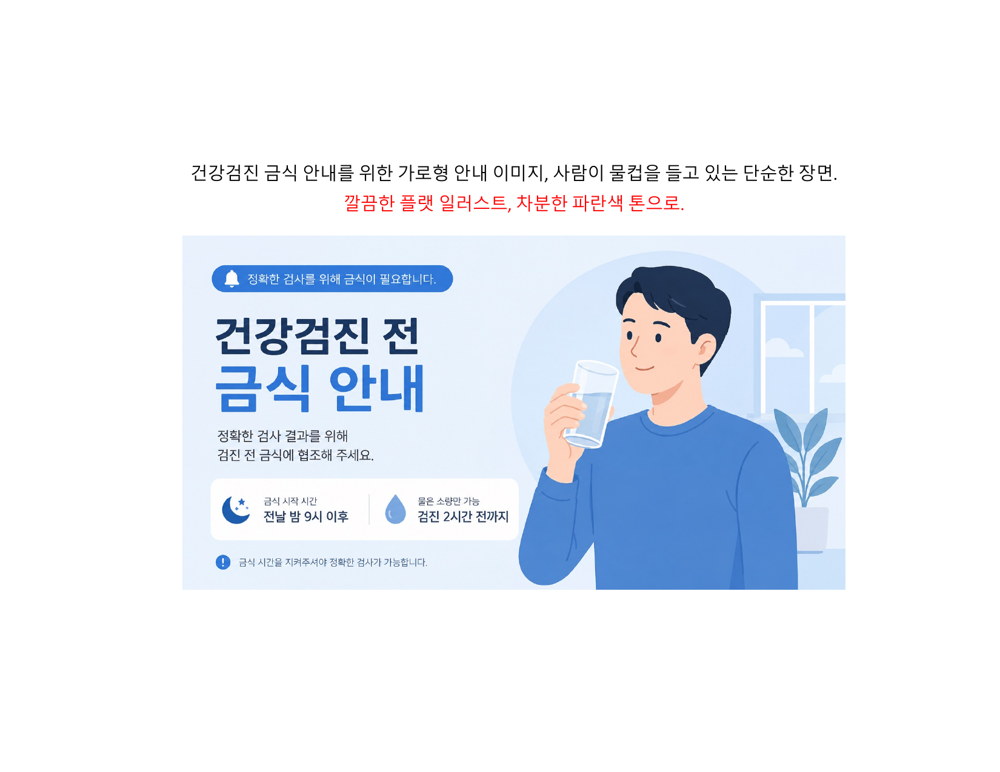
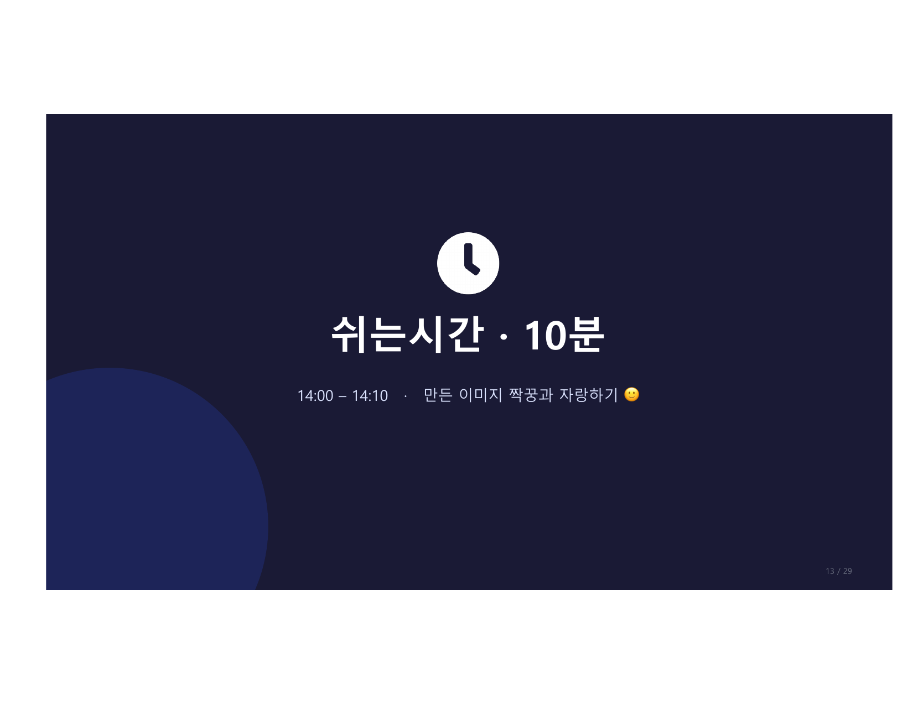

# 1교시 실습 · 이미지 1장 만들기

> **직접 해봅니다** — 이미지 4요소로 내 업무 안내 이미지를 만들어보세요.

<figure markdown>
  { width="700" }
</figure>

---

## 실습 순서

```
① 이미지 4요소로 "내 업무 안내 이미지" 한 줄 입력
② AI가 그려준 이미지 확인
③ 마음에 안 들면 "다시" 또는 한 군데만 바꿔 요청
④ 마음에 드는 1장 고르기
```

!!! info "기억하세요"
    - 한 번에 완벽 안 나와도 정상 — 그게 당연, 대화로 고쳐가기
    - 무료는 한도 있으니 신중히 → **마음에 드는 1장만 남기기**

---

## 4요소 작성 템플릿

이 4줄을 채워서 ChatGPT에 입력해보세요.

```
무엇을:  [그릴 대상 — 예: 검진 금식 안내, 수검자 안내]
스타일:  [그림체 — 예: 따뜻한 플랫 일러스트 / 만화풍 / 사실적인 사진]
색감:    [분위기 — 예: 파란 톤 / 파스텔 / 따뜻한 색감]
용도:    [크기·형태 — 예: 가로 안내문용 / 1:1 인스타용 / 세로 포스터]

→ 위 조건으로 안내 이미지를 그려줘.
```

---

## 완성 예시 프롬프트

=== "금식 안내 이미지"

    ```
    건강검진 금식 안내를 위한 이미지,
    물컵을 들고 있는 사람이 있는 장면,
    따뜻한 플랫 일러스트, 파스텔 파란 톤,
    가로 안내문용 16:9 비율로 그려줘.
    ```

=== "초음파 검사 안내"

    ```
    초음파 검사 전 주의사항 안내 이미지,
    침대에 누워있는 환자와 의료진,
    깔끔한 플랫 일러스트, 차분한 파란 톤,
    가로형 안내 카드로 그려줘.
    ```

=== "예약 안내 카드"

    ```
    건강검진 예약 변경 안내 카드,
    달력과 전화기 아이콘이 있는 심플한 구성,
    친근한 만화풍, 밝고 따뜻한 색감,
    1:1 정사각형 카카오톡 카드용으로 그려줘.
    ```

=== "검진 절차 인포그래픽"

    ```
    건강검진 절차를 접수→문진→검사→결과 4단계로 표현한 인포그래픽,
    각 단계에 간단한 아이콘 포함,
    깔끔한 플랫 디자인, 파란 계열 색상,
    가로형 흰 배경, 큰 화살표로 흐름 표시해줘.
    ```

---

## 수정 요청 표현 모음

원하는 결과가 안 나왔을 때 이렇게 말해보세요:

| 상황 | 수정 요청 |
|------|----------|
| 너무 어두움 | "더 밝고 화사하게 바꿔줘. 기존 구성·인물은 유지해줘" |
| 스타일이 다름 | "플랫 일러스트 스타일로 다시 그려줘" |
| 글자 넣고 싶음 | "'금식 8시간 필수' 글자를 이미지 상단에 넣어줘. 폰트는 굵게" |
| 색이 마음에 안 듦 | "파란 톤 대신 초록 계열로만 바꿔줘. 나머지는 그대로" |
| 처음부터 다시 | "이 느낌 말고, 더 미니멀하고 심플하게 다시 그려줘" |

!!! warning "수정할 때 주의"
    수정 요청 시 **유지할 것을 함께 명시**하세요.
    그렇지 않으면 전혀 다른 이미지가 나올 수 있어요.

---

## 우리 부서라면?

<figure markdown>
  { width="700" }
</figure>

| 부서 | 활용 예시 |
|------|----------|
| **종합검사·간호직** | 종합검진 당일 금식·준비 안내 이미지 |
| **영상의학팀** | 초음파·CT 검사 준비 안내 이미지 |
| **원무·상담** | 재검·예약 변경 안내 카드 이미지 |
| **경영지원·마케팅** | 검진 프로모션·캠페인 이미지 |

---

## 다음 교시

👉 [2교시 실전 이미지](../session5/index.md) — 인포그래픽 + 글자 넣기
