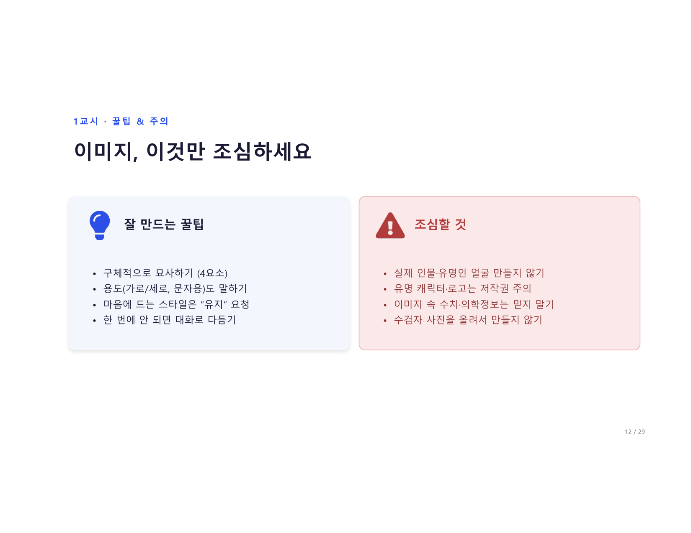
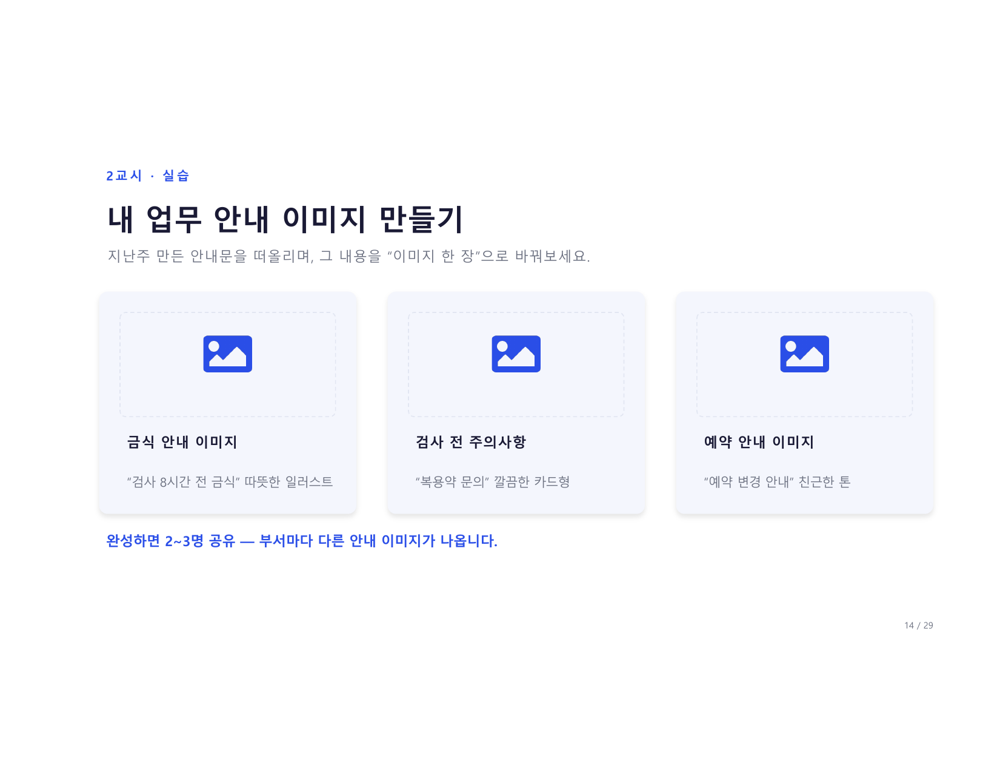
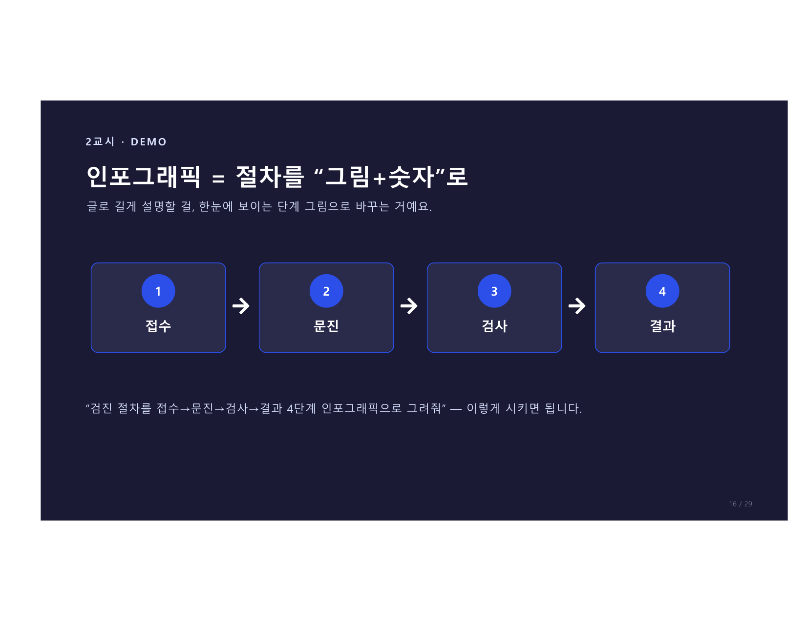

# 2교시 · 실전 이미지

> **14:10 – 14:40** · 이제 실전입니다.

---

## 내 업무 안내 이미지 만들기

<figure markdown>
  { width="700" }
</figure>

지난주 만든 안내문을 떠올리며, 그 내용을 **"이미지 한 장"** 으로 바꿔보세요.

=== "금식 안내 이미지"

    **"검사 8시간 전 금식"** — 따뜻한 일러스트

    ```
    건강검진 금식 안내 이미지,
    음식에 X 표시가 있는 심플한 구성,
    따뜻한 플랫 일러스트, 주황·베이지 색감,
    가로 안내문용으로 그려줘.
    ```

=== "검사 전 주의사항"

    **"복용약 문의"** — 깔끔한 카드형

    ```
    약 복용 관련 검진 주의사항 안내 카드,
    약봉지와 물음표 아이콘 포함,
    깔끔한 플랫 디자인, 파란 계열,
    1:1 카드형으로 그려줘.
    ```

=== "예약 안내 이미지"

    **"예약 변경 안내"** — 친근한 톤

    ```
    건강검진 예약 변경 안내 이미지,
    달력과 체크 아이콘,
    친근한 만화풍, 밝고 따뜻한 색감,
    가로 안내문으로 그려줘.
    ```

완성하면 2~3명 공유 — 부서마다 다른 안내 이미지가 나옵니다.

---

## 부서별 이미지 아이디어

| 부서 | 추천 이미지 |
|------|------------|
| **종합검사·간호직** | 종합검진 당일 준비 안내 이미지 |
| **영상의학팀** | 초음파·CT 검사 준비 안내 이미지 |
| **원무·상담** | 예약·재검 안내 카드 이미지 |
| **경영지원·마케팅** | 검진 프로모션·캠페인 이미지 |

---

## 인포그래픽 = 절차를 "그림+숫자"로

<figure markdown>
  { width="700" }
</figure>

글로 길게 설명할 걸, **한눈에 보이는 단계 그림**으로 바꾸는 거예요.

```
"검진 절차를 접수→문진→검사→결과 4단계 인포그래픽으로 그려줘"
```

이렇게 시키면 됩니다.

---

## 인포그래픽은 "산출물 명세서"처럼

<figure markdown>
  { width="700" }
</figure>

일러스트 요청이 아니라, **무엇이 들어가야 하는지** 정확히 명시해야 합니다.

=== "막연한 지시 ❌"

    ```
    "예쁘게 설명 그림 만들어줘"
    ```
    → 장식만 화려, 정작 정보를 못 읽음

=== "명세서형 지시 ✅"

    ```
    "흰 배경, 큰 제목, 화살표 중심으로
    접수→문진→검사→결과 4단계 인포그래픽.
    각 단계에 아이콘 + 단계 이름 표시,
    파란 계열 색상, 가로형으로 그려줘."
    ```
    → 텍스트·라벨·구조를 콕 집어서

!!! tip "판단 기준"
    **"10초 안에 구조 이해"** 가 되어야 좋은 인포그래픽입니다.
    작은 글자·복잡한 배경·장식 요소는 금지!

=== "꼭 들어갈 요소"

    실제 문구를 따옴표로 명시하세요:

    - 제목 텍스트 (예: `"건강검진 절차 안내"`)
    - 각 단계 이름 (예: `"접수", "문진", "검사", "결과"`)
    - 아이콘 설명
    - 화살표 방향
    - 강조 색상

---

## 글자가 들어간 이미지도 됩니다

<figure markdown>
  { width="700" }
</figure>

제목·핵심 문구를 넣어달라고 하면, 게시판·SNS용 카드 한 장이 나옵니다.

!!! success "이렇게 활용해요"
    - 검진 안내 게시판에 붙이는 포스터
    - 카카오톡·문자로 보내는 안내 카드
    - 원내 모니터·SNS용 캠페인 이미지
    - 신입 교육자료 표지

```
건강검진 금식 안내 포스터,
'검사 8시간 전 금식 필수' 텍스트를 크게 중앙에,
물컵 아이콘과 함께, 오타·번역·추가 금지,
파스텔 파란 배경, 깔끔한 플랫 디자인으로 그려줘.
```

---

## 장르별 디테일 — 텍스트·인물·실사

<figure markdown>
  { width="700" }
</figure>

자주 빠뜨리는 조건들 — 장르마다 챙겨야 할 게 다릅니다.

=== "텍스트가 들어갈 때"

    정확한 문구 + 스타일

    - 문구를 **따옴표**로 감싸서 입력
    - 글꼴·크기·위치까지 같이 명시
    - 예) `"오타·번역·추가 금지"`

    ```
    '금식 8시간' 텍스트를 상단 굵은 글씨로,
    한국어 그대로 유지, 오타·추가 글자 금지.
    ```

=== "인물 사진을 바꿀 때"

    얼굴 유지 조건은 과하게

    - 헤어·안경·피부톤·인상까지 명시
    - 예) `"얼굴형·눈매·표정 고정"`

    ```
    옷만 흰 가운으로 바꿔줘.
    얼굴형·눈매·표정·머리·피부톤은 그대로 유지.
    ```

=== "실사 느낌이 필요할 때"

    카메라로 찍은 듯이

    - 피부 질감·옷감 주름 같은 디테일 명시
    - 예) `"35mm, 자연광, 얕은 심도"`

    ```
    카메라로 찍은 듯한 사실적인 사진 스타일,
    자연광, 35mm 렌즈, 배경 살짝 흐리게.
    ```

=== "공통 원칙"

    장르 불문하고 적용

    매번 **유지 + 변경 + 금지** 조건을 다시 적어야 흔들리지 않음

    ```
    [유지] 현재 구도·색감·스타일
    [변경] OO 부분만
    [금지] 얼굴 변경 금지, 텍스트 추가 금지
    ```

---

## 다음 페이지

👉 [2교시 실습 가이드](practice.md) — 인포그래픽 직접 만들어봅니다
