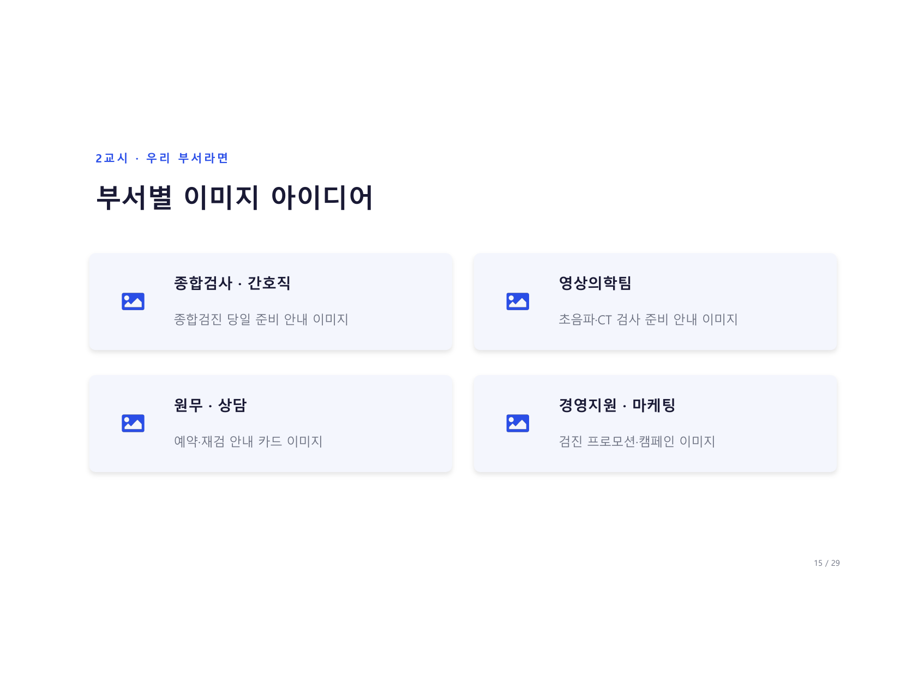

# 2교시 실습 · 검진 절차 인포그래픽

> **직접 만들어봅니다** — 우리 부서 검진 절차를 인포그래픽으로

<figure markdown>
  { width="700" }
</figure>

---

## 실습 순서

```
① 우리 부서 검진 절차를 3~4단계로 정리
② "이 절차를 단계별 인포그래픽으로" 요청
③ 단계 이름·순서가 맞는지 확인
④ 글자·색이 어색하면 다듬기
```

---

## 검진 절차 인포그래픽 프롬프트 템플릿

아래 템플릿에서 `[ ]` 부분만 채워서 입력해보세요.

```
[검진 종류] 절차를 [단계 수]단계 인포그래픽으로 그려줘.

단계:
1단계: [단계 이름] — [간단한 설명]
2단계: [단계 이름] — [간단한 설명]
3단계: [단계 이름] — [간단한 설명]
4단계: [단계 이름] — [간단한 설명]

각 단계에 아이콘 포함, 화살표로 흐름 연결.
[색감] 색상, [방향] 방향, 흰 배경.
10초 안에 구조가 이해되는 심플한 디자인으로.
```

---

## 완성 예시

=== "건강검진 4단계"

    ```
    건강검진 절차를 4단계 인포그래픽으로 그려줘.

    단계:
    1단계: 접수 — 신분증 확인, 동의서 작성
    2단계: 문진 — 건강 상태 체크
    3단계: 검사 — 혈액·영상·내시경
    4단계: 결과 — 결과지 수령, 상담

    각 단계에 심플한 아이콘, 화살표로 흐름 연결.
    차분한 파란 계열, 가로 방향, 흰 배경.
    10초 안에 구조 이해되는 깔끔한 플랫 디자인으로.
    ```

=== "초음파 검사 준비"

    ```
    복부 초음파 검사 준비 절차를 3단계로 그려줘.

    1단계: 금식 — 검사 6시간 전부터 금식
    2단계: 준비 — 편한 복장으로 내원
    3단계: 검사 — 누운 자세로 10분

    아이콘 포함, 주황·베이지 따뜻한 색감,
    세로형 안내 카드로, 깔끔하게.
    ```

=== "신입 교육 흐름도"

    ```
    신입 직원 건강검진 교육 흐름도,
    OT → 이론 → 실습 → 평가 4단계,
    각 단계에 소요시간 표시,
    화살표 중심 가로 인포그래픽,
    파란 계열, 흰 배경으로 그려줘.
    ```

---

## 글자 넣기 실습

<figure markdown>
  { width="700" }
</figure>

게시판·SNS용 안내 카드를 만들어봅니다.

```
[안내 제목] 포스터를 만들어줘.

메인 텍스트: '[핵심 문구]' — 크게, 굵게, 중앙에
서브 텍스트: '[부가 설명]' — 작게 아래에
아이콘: [관련 아이콘]

[색감] 배경, 한국어 텍스트 그대로 유지,
오타·번역·추가 글자 절대 금지,
[비율] 비율로.
```

**예시:**
```
건강검진 금식 안내 포스터를 만들어줘.

메인 텍스트: '검사 전 8시간 금식' — 크게, 굵게, 중앙에
서브 텍스트: '물·약은 담당자에게 문의' — 작게 아래에
아이콘: 물컵에 X 표시

파스텔 파란 배경, 한국어 텍스트 그대로 유지,
오타·번역·추가 글자 절대 금지,
가로 16:9 비율로.
```

!!! warning "텍스트 이미지 주의사항"
    AI가 텍스트 이미지를 생성할 때 오타나 이상한 글자가 나올 수 있어요.
    **"오타·번역·추가 글자 금지"** 를 매번 명시하고, 결과물을 꼭 확인하세요.

---

## 다음 교시

👉 [3교시 노션 DB](../session6/index.md) — 만든 이미지를 노션에 정리합니다
