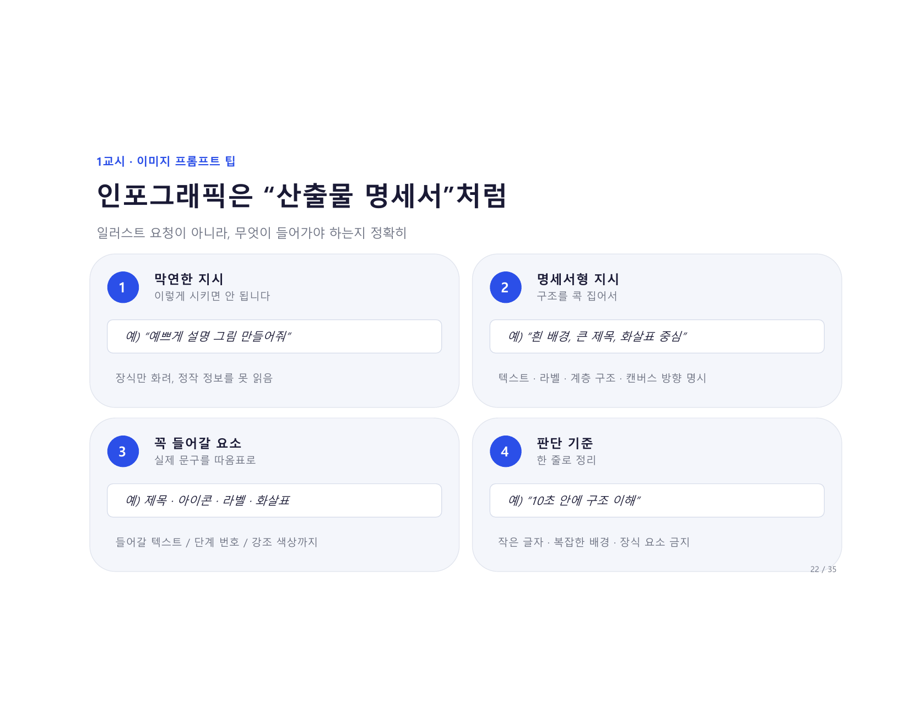
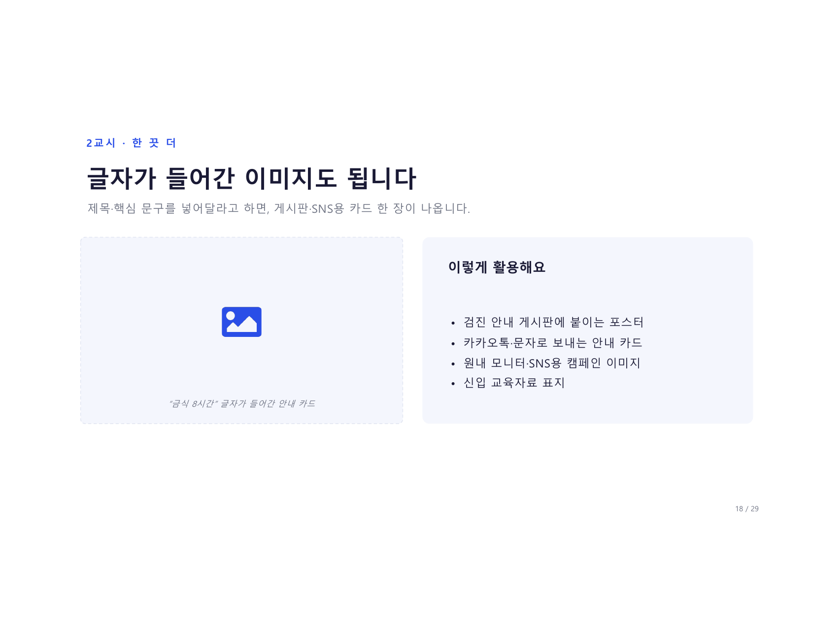
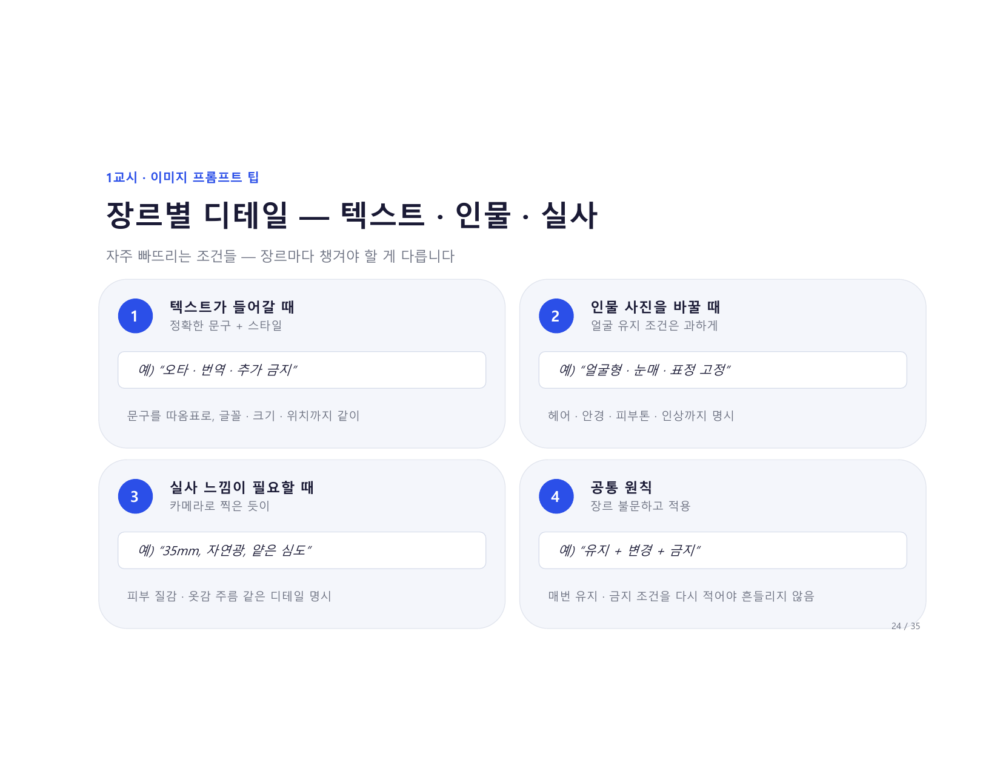
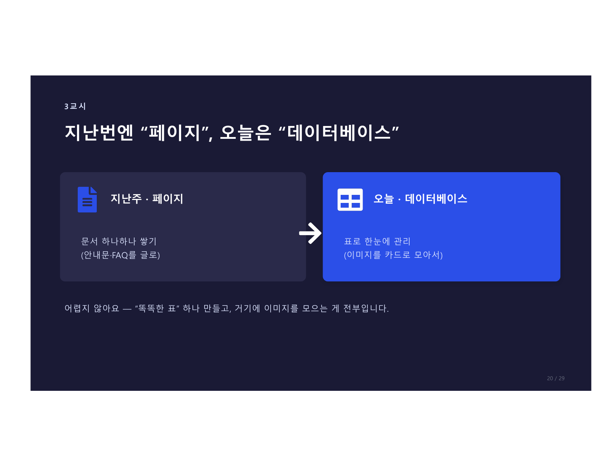
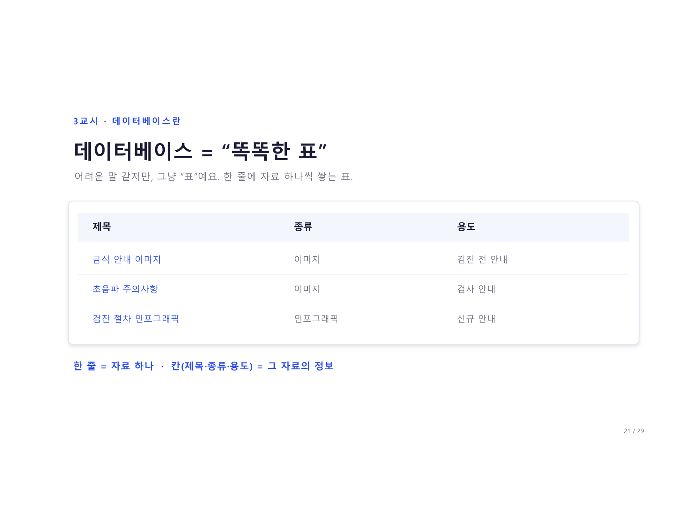
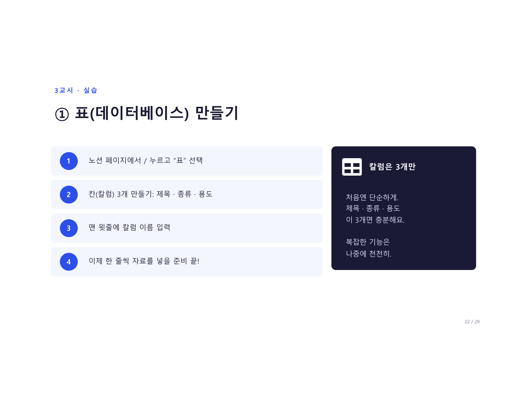
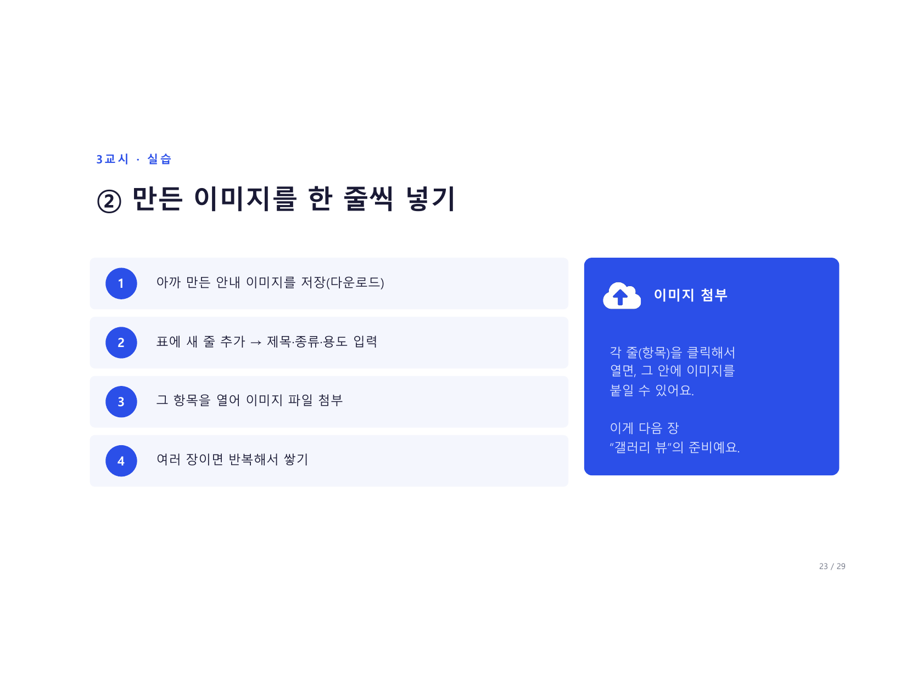

# 3교시 · 노션 데이터베이스 입문

> **14:50 – 15:30** · 이제 만든 이미지들을 노션에 정리합니다.

---

## 지난번엔 "페이지", 오늘은 "데이터베이스"

<figure markdown>
  { width="700" }
</figure>

| | 지난주 · 페이지 | 오늘 · 데이터베이스 |
|--|----------------|-------------------|
| **방식** | 문서 하나하나 쌓기 | 표로 한눈에 관리 |
| **내용** | 안내문·FAQ를 글로 | 이미지를 카드로 모아서 |

어렵지 않아요 — **"똑똑한 표" 하나 만들고, 거기에 이미지를 모으는 게 전부**입니다.

---

## 데이터베이스 = "똑똑한 표"

<figure markdown>
  { width="700" }
</figure>

!!! quote "한 줄 정의"
    **데이터베이스 = 한 줄에 자료 하나씩 쌓는 표**

어려운 말 같지만, 그냥 "표"예요.

| 제목 | 종류 | 용도 |
|------|------|------|
| 금식 안내 이미지 | 이미지 | 검진 전 안내 |
| 초음파 주의사항 | 이미지 | 검사 안내 |
| 검진 절차 인포그래픽 | 인포그래픽 | 신규 안내 |

**한 줄 = 자료 하나 · 칸(제목·종류·용도) = 그 자료의 정보**

---

## 실습 ① 표(데이터베이스) 만들기

<figure markdown>
  { width="700" }
</figure>

### 4단계 실습

```
1. 노션 페이지에서 / 누르고 "표" 선택
2. 칸(칼럼) 3개 만들기: 제목 · 종류 · 용도
3. 맨 윗줄에 칼럼 이름 입력
4. 이제 한 줄씩 자료를 넣을 준비 끝!
```

!!! tip "칼럼은 3개만"
    처음엔 단순하게 — **제목 · 종류 · 용도**
    이 3개면 충분해요. 복잡한 기능은 나중에 천천히.

---

## 실습 ② 만든 이미지를 한 줄씩 넣기

<figure markdown>
  { width="700" }
</figure>

```
1. 아까 만든 안내 이미지를 저장(다운로드)
2. 표에 새 줄 추가 → 제목·종류·용도 입력
3. 그 항목을 열어 이미지 파일 첨부
4. 여러 장이면 반복해서 쌓기
```

!!! info "이미지 첨부 방법"
    각 줄(항목)을 클릭해서 열면, 그 안에 이미지를 붙일 수 있어요.
    이게 다음 "갤러리 뷰"의 준비예요.

---

## 실습 ③ 갤러리 뷰 = 이미지가 "카드"로

<figure markdown>
  { width="700" }
</figure>

!!! success "오늘의 하이라이트"
    같은 표를 "갤러리"로 바꾸면, 글자 표가 이미지 카드로 쫙 깔립니다.

```
표 우측 "+" 또는 뷰 추가 → "갤러리" 선택. 그게 끝이에요.
```

결과:

```
[금식 안내]  [초음파 주의]  [검진 절차]
  [이미지]      [이미지]      [이미지]
  카드형        카드형        카드형
```

---

## 표 vs 갤러리 — 자료는 하나, 보기만 다름

<figure markdown>
  { width="700" }
</figure>

| | 표 보기 | 갤러리 보기 |
|--|---------|------------|
| **언제** | 정보를 정리·관리할 때 | 이미지를 "보고 고를" 때 |
| **보이는 것** | 제목·종류·용도 한눈에 | 썸네일 카드로 쫙 |

!!! note "핵심"
    뷰를 바꿔도 자료는 그대로 —
    하나의 표를 상황에 맞게 다르게 볼 뿐이에요.

---

## 말 한마디로도 정리됩니다

<figure markdown>
  { width="700" }
</figure>

지난주 ChatGPT ↔ 노션 연결을 해두셨다면, 이렇게 한 줄만 입력해도 됩니다:

```
오늘 만든 안내 이미지 목록을
노션에 표로 정리해줘.

항목:
- 금식 안내 이미지 / 이미지 / 검진 전 안내
- 초음파 주의사항 / 이미지 / 검사 안내
- 검진 절차 인포그래픽 / 인포그래픽 / 신규 안내
```

노션에 표가 **"짠"** 하고 만들어져요.

!!! tip "복습"
    지난주 `Apps → Notion 연결`을 해두셨다면 무료로도 됩니다.
    연결 방법은 [1일차 3교시 가이드](../../session3/index.md)의 STEP 6 항목을 참고하세요.

---

## 이게 "우리 부서 이미지 자료실"이 됩니다

<figure markdown>
  { width="700" }
</figure>

| 장점 | 설명 |
|------|------|
| **한곳에 모이고** | 안내 이미지·인포그래픽이 갤러리 카드로 한눈에 |
| **팀이 같이 쓰고** | 필요할 때 꺼내서 안내문·게시판에 재사용 |
| **계속 쌓이고** | 새로 만들 때마다 자료실이 풍성해짐 |

> 지난주 **"글 자료실"**, 오늘 **"이미지 자료실"** — 우리 팀 기억창고가 그림까지 갖췄어요.

---

## 다음 페이지

👉 [3교시 실습 가이드](practice.md) — 노션 DB 직접 만들어봅니다
