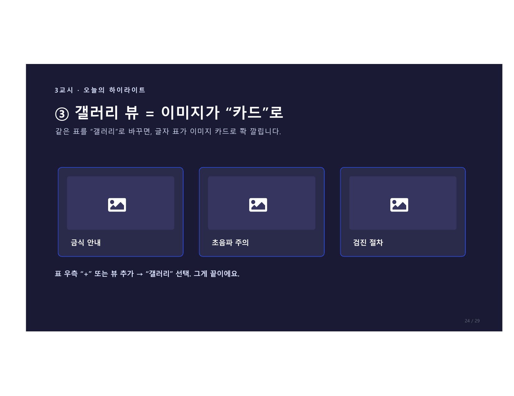
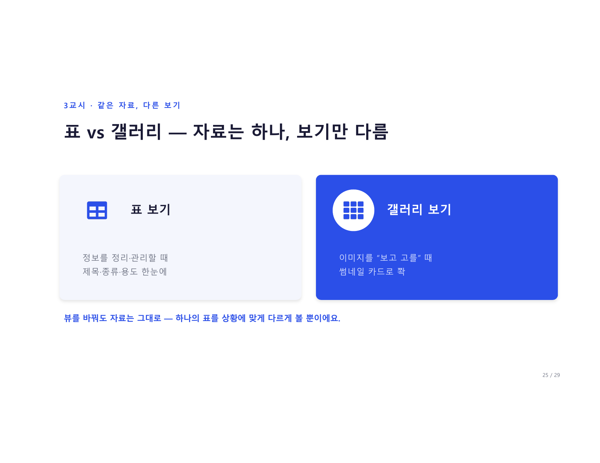
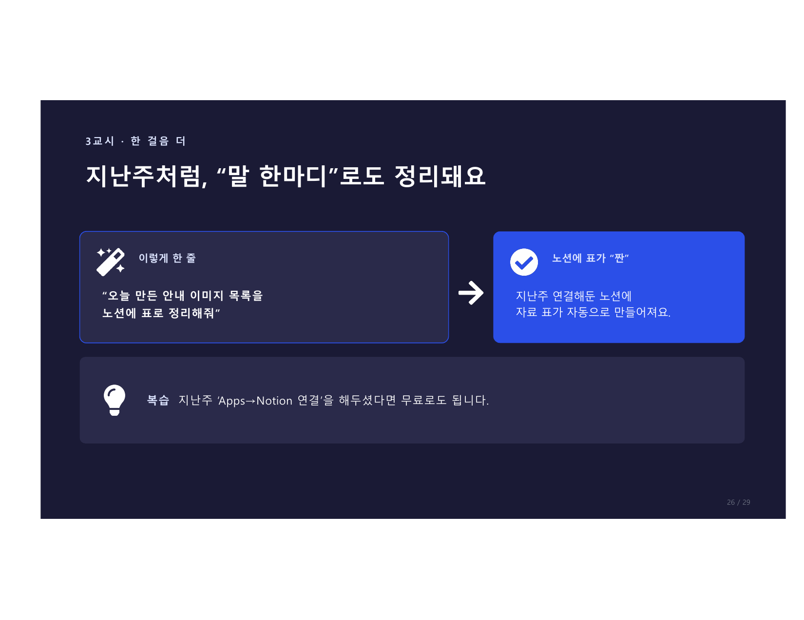

# 3교시 실습 · 노션 이미지 자료실 만들기

> **Step by Step** — "우리 부서 이미지 자료실"을 완성합니다.

<figure markdown>
  { width="700" }
</figure>

---

## 전체 흐름

```
STEP 1  노션에서 표(데이터베이스) 만들기
STEP 2  이미지를 한 줄씩 넣기
STEP 3  갤러리 뷰로 전환
STEP 4  (선택) ChatGPT로 자동 정리
```

---

## STEP 1 · 표 만들기

### 노션에서 시작

```
노션 페이지 → / 누르기 → "표" 또는 "데이터베이스" 선택
```

### 칼럼(칸) 설정

| 칼럼 이름 | 타입 | 설명 |
|----------|------|------|
| **제목** | 텍스트 | 이미지 이름 |
| **종류** | 선택 | 이미지 / 인포그래픽 / 포스터 |
| **용도** | 텍스트 | 어디에 쓰는 이미지인지 |

!!! tip "칼럼 추가"
    나중에 칼럼을 더 추가할 수 있어요.
    처음엔 이 3개만으로 충분합니다.

---

## STEP 2 · 이미지 한 줄씩 넣기

### 새 항목 추가

```
표에서 "+ 새로 만들기" 클릭
→ 제목 입력 (예: "금식 안내 이미지")
→ 종류 선택 (예: "이미지")
→ 용도 입력 (예: "검진 전 안내")
```

### 이미지 첨부

```
항목 클릭해서 열기
→ 빈 줄에서 / → "이미지" 또는 파일 업로드
→ ChatGPT에서 저장한 이미지 파일 선택
```

!!! success "이 동작 하나로"
    이미지가 표 항목에 연결됩니다.
    갤러리로 보면 이 이미지가 카드 썸네일로 나타나요.

---

## STEP 3 · 갤러리 뷰 전환

### 갤러리 뷰 추가 방법

```
표 우측 상단 "+" 버튼 클릭
→ "갤러리" 선택
→ 뷰 이름 입력 (예: "이미지 자료실")
→ 완성!
```

### 썸네일 설정

```
갤러리 뷰 우측 상단 "..." → "속성"
→ "카드 미리보기" → "페이지 커버" 또는 첨부파일 선택
```

!!! note "뷰 전환"
    표 뷰와 갤러리 뷰를 탭으로 전환할 수 있어요.
    자료는 하나 — 보는 방식만 바뀝니다.

---

## STEP 4 (선택) · ChatGPT로 자동 정리

ChatGPT ↔ 노션 연결이 되어 있다면, 말 한마디로 자동 등록이 됩니다.

```
오늘 만든 안내 이미지 목록을 노션에 표로 정리해줘.

페이지: "우리 팀 검진 안내 키트"
형식: 제목 / 종류 / 용도 3칼럼

항목:
- 금식 안내 이미지 / 이미지 / 검진 전 안내
- 초음파 주의사항 / 이미지 / 검사 안내
- 검진 절차 인포그래픽 / 인포그래픽 / 신규 안내
```

---

## 우리 부서 이미지 자료실, 뭘 채울까?

<figure markdown>
  { width="700" }
</figure>

우리 부서에서 **"자주 쓰는 안내"** 를 이미지로 만들어 모아둔다면?

| 카테고리 | 예시 |
|----------|------|
| **검사별 준비 안내** | 금식·복약·소요시간 |
| **절차 인포그래픽** | 접수~결과 한눈에 |
| **게시판 포스터** | 캠페인·예약 안내 |
| **신입 교육 이미지** | 업무 흐름 그림 |

적었으면 2~3명 공유 — 부서별 "이미지 자료실" 설계도가 나옵니다.

---

## 2주, 한 사이클 완성

<figure markdown>
  { width="700" }
</figure>

```
① 글로 안내 만들고  →  ② 그림으로 보기 좋게  →  ③ 노션 DB에 모아 재사용
```

!!! success "축하합니다!"
    이제 여러분은 AI로 **글·그림을 만들고**, 노션에 모아 **팀과 재사용**할 수 있습니다.

    - **1일차:** 안내문·문자·FAQ → 노션 페이지에 쌓기
    - **2일차:** 안내 이미지·인포그래픽 → 노션 갤러리에 모으기
    - **합쳐서:** 우리 팀 "검진 안내 키트" 완성

> **감을 잡으면, 혼자서도 끝까지 갑니다.**
